<picture>
  <source media="(prefers-color-scheme: dark)" srcset="./assets/hero-dark.svg">
  
</picture>

  
  
  
  

  Product-focused data analyst working with SQL, Python, experimentation, and portfolio projects grounded in real business questions.

  
  

  
  
  

## Profile

- Data analyst focused on product metrics, analytical storytelling, and decisions grounded in signal instead of noise
- Working across SQL, Python, experimentation, funnel analysis, and time-series workflows
- Studying Mathematical Foundations of Artificial Intelligence at Innopolis University

## Toolkit

  
  
  
  
  
  
  
  
  

## What I Build

- Product analytics case studies with KPI trees, funnel logic, retention framing, and experiment readouts
- Portfolio projects that simulate business questions instead of isolated notebook exercises
- Analytical workflows that turn messy operational data into concise decisions

## Featured Repositories

| Repository | What it shows |
| --- | --- |
|  | Product metrics design, SQL exploration, KPI framing, and business-facing analysis. |
|  | Time-series workflows, signal cleanup, trend reading, and practical forecasting intuition. |
|  | Experiment logic, simulation-based thinking, and clear interpretation of A/B test outcomes. |
|  | Applied analytics and automation around routing logic, categorization, and operational decision support. |

## Focus Areas

- Product metrics, conversion funnels, retention logic, and analytical framing
- A/B test analysis with clear interpretation instead of just statistical output
- Time-series exploration, signal cleanup, and business-facing visualization

## Signal Layer

  

