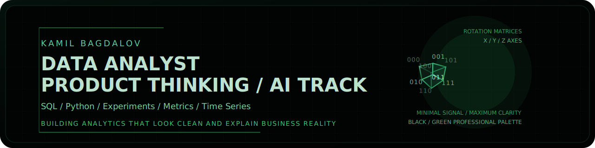

<picture>
  <source media="(prefers-color-scheme: dark)" srcset="./assets/hero-dark.svg">
  
</picture>

  
  
  
  

  Product-focused data analyst working with SQL, Python, experimentation, and portfolio projects grounded in real business questions.

  <a href="mailto:bagdalovk@gmail.com">Email</a> /
  <a href="https://t.me/respectfully001">Telegram</a>

## Profile

- Data analyst focused on product metrics, analytical storytelling, and decisions grounded in signal instead of noise
- Working across SQL, Python, experimentation, funnel analysis, and time-series workflows
- Studying Mathematical Foundations of Artificial Intelligence at Innopolis University

## Toolkit

`Python` `SQL` `PostgreSQL` `SQLite` `pandas` `numpy` `matplotlib` `seaborn` `Jupyter`

## What I Build

- Product analytics case studies with KPI trees, funnel logic, retention framing, and experiment readouts
- Portfolio projects that simulate business questions instead of isolated notebook exercises
- Analytical workflows that turn messy operational data into concise decisions

## Featured Repositories

  
  

  
  

## Focus Areas

- Product metrics, conversion funnels, retention logic, and analytical framing
- A/B test analysis with clear interpretation instead of just statistical output
- Time-series exploration, signal cleanup, and business-facing visualization

## GitHub Snapshot

  
  

  
  

